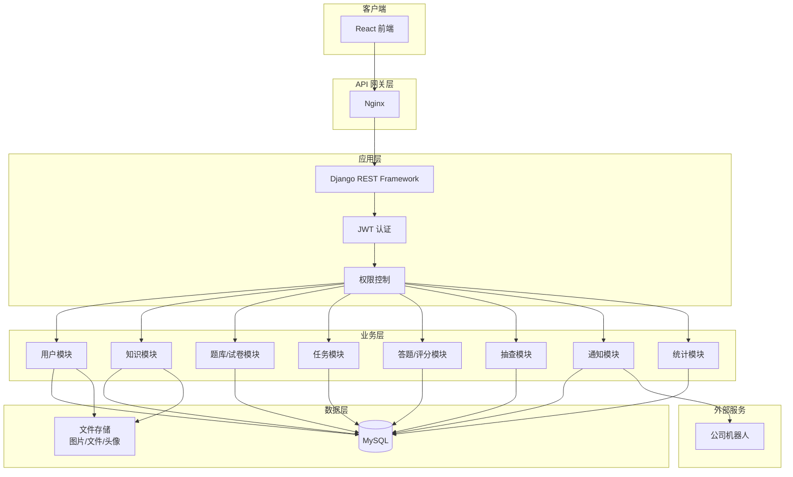
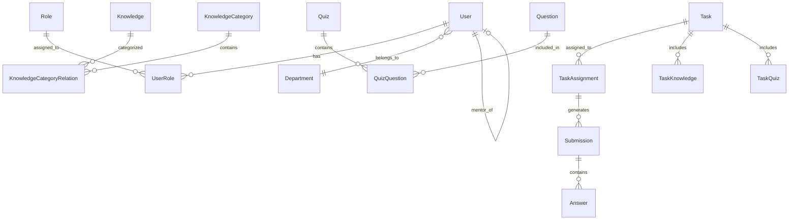

# LMS 后端设计文档

## Overview

本设计文档描述 LMS（学习管理系统）后端的技术架构和实现方案。系统采用 Django + Django REST Framework 构建，使用 MySQL 数据库，实现"学、练、考、评"的能力闭环。

### 核心设计原则

1. **资源与任务分离**：知识文档、题目、试卷作为资源先行创建，任务作为分配动作后续发布
2. **基于角色的访问控制（RBAC）**：五种角色（学员、导师、室经理、管理员、团队经理）具有不同的数据访问范围
3. **数据范围隔离**：导师仅访问名下学员数据，室经理访问本室数据，管理员访问全平台数据
4. **软删除策略**：关键业务数据支持软删除，保留历史记录

### 技术栈

- **Web 框架**: Django 4.2+ / Django REST Framework 3.14+
- **数据库**: MySQL 8.0+
- **认证**: JWT (djangorestframework-simplejwt)
- **文件存储**: 用于存储图片、文件附件、用户头像等静态资源和头像
- **API 文档**: drf-spectacular (OpenAPI 3.0)

### 开发环境配置

**Python 环境**：
```bash
conda activate lms
```

**数据库配置**：
```python
DATABASES = {
    'default': {
        'ENGINE': 'django.db.backends.mysql',
        'NAME': 'lms',
        'USER': 'root',
        'PASSWORD': '15572353184',
        'HOST': 'localhost',
        'PORT': '3306',
        'OPTIONS': {
            'charset': 'utf8mb4',
        },
    }
}
```

---

## Architecture

### 系统架构图



### Django 应用结构

```
lms_backend/
├── config/                    # 项目配置
│   ├── settings/
│   │   ├── base.py           # 基础配置
│   │   ├── development.py    # 开发环境
│   │   └── production.py     # 生产环境
│   ├── urls.py               # 根路由
│   └── wsgi.py
│
├── apps/                      # 业务应用
│   ├── users/                # 用户与权限
│   │   ├── models.py
│   │   ├── serializers.py
│   │   ├── views.py
│   │   ├── permissions.py
│   │   └── services.py
│   │
│   ├── knowledge/            # 知识库
│   │   ├── models.py
│   │   ├── serializers.py
│   │   ├── views.py
│   │   └── services.py
│   │
│   ├── questions/            # 题库
│   │   ├── models.py
│   │   ├── serializers.py
│   │   ├── views.py
│   │   └── services.py
│   │
│   ├── quizzes/              # 试卷
│   │   ├── models.py
│   │   ├── serializers.py
│   │   ├── views.py
│   │   └── services.py
│   │
│   ├── tasks/                # 任务
│   │   ├── models.py
│   │   ├── serializers.py
│   │   ├── views.py
│   │   └── services.py
│   │
│   ├── submissions/          # 答题与评分
│   │   ├── models.py
│   │   ├── serializers.py
│   │   ├── views.py
│   │   └── services.py
│   │
│   ├── spot_checks/          # 抽查
│   │   ├── models.py
│   │   ├── serializers.py
│   │   ├── views.py
│   │   └── services.py
│   │
│   ├── notifications/        # 通知（对接公司机器人）
│   │   ├── models.py
│   │   ├── serializers.py
│   │   ├── views.py
│   │   └── services.py       # 机器人对接服务
│   │
│   └── analytics/            # 统计分析
│       ├── models.py
│       ├── serializers.py
│       ├── views.py
│       └── services.py
│
├── core/                      # 核心模块
│   ├── permissions.py        # 通用权限类
│   ├── pagination.py         # 分页配置
│   ├── exceptions.py         # 异常处理
│   ├── mixins.py             # 通用 Mixin
│   └── utils.py              # 工具函数
│
└── tests/                     # 测试
    ├── conftest.py
    ├── factories.py
    └── ...
```

---

## Components and Interfaces

### 1. 认证模块 (Authentication)

#### API 端点

| 方法 | 端点 | 描述 | 权限 |
|------|------|------|------|
| POST | `/api/auth/login/` | 用户登录 | 公开 |
| POST | `/api/auth/logout/` | 用户登出 | 已认证 |
| POST | `/api/auth/refresh/` | 刷新 Token | 已认证 |
| POST | `/api/auth/switch-role/` | 切换角色 | 已认证 |
| POST | `/api/auth/reset-password/` | 重置密码 | 管理员 |

#### 接口定义

```python
# 登录请求
class LoginRequest:
    username: str
    password: str

# 登录响应
class LoginResponse:
    access_token: str
    refresh_token: str
    user: UserInfo
    available_roles: List[RoleInfo]
    current_role: str

# 切换角色请求
class SwitchRoleRequest:
    role_code: str  # STUDENT, MENTOR, DEPT_MANAGER, ADMIN, TEAM_MANAGER
```

### 2. 用户管理模块 (Users)

#### API 端点

| 方法 | 端点 | 描述 | 权限 |
|------|------|------|------|
| GET | `/api/users/` | 用户列表 | 管理员 |
| POST | `/api/users/` | 创建用户 | 管理员 |
| GET | `/api/users/{id}/` | 用户详情 | 管理员 |
| PATCH | `/api/users/{id}/` | 更新用户 | 管理员 |
| POST | `/api/users/{id}/deactivate/` | 停用用户 | 管理员 |
| POST | `/api/users/{id}/activate/` | 启用用户 | 管理员 |
| POST | `/api/users/{id}/assign-roles/` | 分配角色 | 管理员 |
| POST | `/api/users/{id}/assign-mentor/` | 指定导师 | 管理员 |
| GET | `/api/users/mentees/` | 获取名下学员 | 导师 |
| GET | `/api/users/department-members/` | 获取本室成员 | 室经理 |

### 3. 知识文档模块 (Knowledge)

#### API 端点

| 方法 | 端点 | 描述 | 权限 |
|------|------|------|------|
| GET | `/api/knowledge/` | 知识列表 | 已认证 |
| POST | `/api/knowledge/` | 创建知识 | 管理员 |
| GET | `/api/knowledge/{id}/` | 知识详情 | 已认证 |
| PATCH | `/api/knowledge/{id}/` | 更新知识 | 管理员 |
| DELETE | `/api/knowledge/{id}/` | 删除知识 | 管理员 |
| GET | `/api/knowledge/categories/` | 分类列表 | 已认证 |
| POST | `/api/knowledge/categories/` | 创建分类 | 管理员 |

### 4. 题目模块 (Questions)

#### API 端点

| 方法 | 端点 | 描述 | 权限 |
|------|------|------|------|
| GET | `/api/questions/` | 题目列表 | 导师/室经理/管理员 |
| POST | `/api/questions/` | 创建题目 | 导师/室经理/管理员 |
| GET | `/api/questions/{id}/` | 题目详情 | 导师/室经理/管理员 |
| PATCH | `/api/questions/{id}/` | 更新题目 | 创建者/管理员 |
| DELETE | `/api/questions/{id}/` | 删除题目 | 创建者/管理员 |
| POST | `/api/questions/import/` | 批量导入 | 管理员 |

### 5. 试卷模块 (Quizzes)

#### API 端点

| 方法 | 端点 | 描述 | 权限 |
|------|------|------|------|
| GET | `/api/quizzes/` | 试卷列表 | 导师/室经理/管理员 |
| POST | `/api/quizzes/` | 创建试卷 | 导师/室经理/管理员 |
| GET | `/api/quizzes/{id}/` | 试卷详情 | 导师/室经理/管理员 |
| PATCH | `/api/quizzes/{id}/` | 更新试卷 | 创建者/管理员 |
| DELETE | `/api/quizzes/{id}/` | 删除试卷 | 创建者/管理员 |
| POST | `/api/quizzes/{id}/add-questions/` | 添加题目 | 创建者/管理员 |

### 6. 任务模块 (Tasks)

#### API 端点

| 方法 | 端点 | 描述 | 权限 |
|------|------|------|------|
| GET | `/api/tasks/` | 任务列表 | 已认证 |
| POST | `/api/tasks/learning/` | 创建学习任务 | 导师/室经理/管理员 |
| POST | `/api/tasks/practice/` | 创建练习任务 | 导师/室经理/管理员 |
| POST | `/api/tasks/exam/` | 创建考试任务 | 导师/室经理/管理员 |
| GET | `/api/tasks/{id}/` | 任务详情 | 已认证 |
| POST | `/api/tasks/{id}/close/` | 强制结束任务 | 管理员 |
| GET | `/api/tasks/my-assignments/` | 我的任务 | 学员 |
| POST | `/api/tasks/{id}/complete-knowledge/` | 完成知识学习 | 学员 |

### 7. 答题与评分模块 (Submissions)

#### API 端点

| 方法 | 端点 | 描述 | 权限 |
|------|------|------|------|
| POST | `/api/submissions/start/` | 开始答题 | 学员 |
| POST | `/api/submissions/{id}/save-answer/` | 保存答案 | 学员 |
| POST | `/api/submissions/{id}/submit/` | 提交答卷 | 学员 |
| GET | `/api/submissions/{id}/result/` | 查看结果 | 学员 |
| GET | `/api/grading/pending/` | 待评分列表 | 导师/室经理 |
| POST | `/api/grading/{submission_id}/grade/` | 提交评分 | 导师/室经理 |

### 8. 抽查模块 (SpotChecks)

#### API 端点

| 方法 | 端点 | 描述 | 权限 |
|------|------|------|------|
| GET | `/api/spot-checks/` | 抽查记录列表 | 导师/室经理 |
| POST | `/api/spot-checks/` | 创建抽查记录 | 导师/室经理 |
| GET | `/api/spot-checks/{id}/` | 抽查详情 | 导师/室经理 |

### 9. 统计分析模块 (Analytics)

#### API 端点

| 方法 | 端点 | 描述 | 权限 |
|------|------|------|------|
| GET | `/api/analytics/dashboard/student/` | 学员仪表盘 | 学员 |
| GET | `/api/analytics/dashboard/mentor/` | 导师仪表盘 | 导师/室经理 |
| GET | `/api/analytics/dashboard/admin/` | 管理员仪表盘 | 管理员 |
| GET | `/api/analytics/team-overview/` | 团队数据概览 | 团队经理 |
| GET | `/api/analytics/knowledge-heat/` | 知识热度 | 团队经理 |

### 10. 通知模块 (Notifications)

用于对接公司机器人，发送任务提醒等通知。

#### API 端点

| 方法 | 端点 | 描述 | 权限 |
|------|------|------|------|
| GET | `/api/notifications/` | 通知列表 | 已认证 |
| GET | `/api/notifications/{id}/` | 通知详情 | 已认证 |
| POST | `/api/notifications/{id}/read/` | 标记已读 | 已认证 |
| POST | `/api/notifications/read-all/` | 全部标记已读 | 已认证 |
| GET | `/api/notifications/unread-count/` | 未读数量 | 已认证 |

#### 通知服务接口

```python
class NotificationService:
    """通知服务 - 预留对接公司机器人"""
    
    def send_task_assigned(self, user_ids: List[int], task: Task) -> None:
        """发送任务分配通知"""
        pass
    
    def send_deadline_reminder(self, user_id: int, task: Task) -> None:
        """发送截止时间提醒"""
        pass
    
    def send_grading_completed(self, user_id: int, submission: Submission) -> None:
        """发送评分完成通知"""
        pass
    
    def send_to_robot(self, user_ids: List[int], message: str) -> bool:
        """
        对接公司机器人发送消息
        预留接口，后续对接时实现具体逻辑
        """
        pass
```

#### 通知类型

| 类型 | 描述 | 触发时机 |
|------|------|----------|
| TASK_ASSIGNED | 任务分配通知 | 创建任务并分配学员时 |
| DEADLINE_REMINDER | 截止时间提醒 | 任务截止前 24 小时 |
| GRADING_COMPLETED | 评分完成通知 | 考试评分完成时 |
| SPOT_CHECK | 抽查通知 | 创建抽查记录时 |

---

## Data Models

数据模型设计遵循前端数据模型设计文档，主要包括以下实体：

### 核心实体关系



### 关键模型定义

#### User 模型
```python
class User(AbstractUser):
    employee_id = CharField(max_length=20, unique=True)
    username = CharField(max_length=50)
    department = ForeignKey(Department, on_delete=PROTECT)
    mentor = ForeignKey('self', null=True, on_delete=SET_NULL)
    is_active = BooleanField(default=True)
```

#### Task 模型
```python
class Task(Model):
    TASK_TYPES = [
        ('LEARNING', '学习任务'),
        ('PRACTICE', '练习任务'),
        ('EXAM', '考试任务'),
    ]
    
    title = CharField(max_length=200)
    type = CharField(max_length=20, choices=TASK_TYPES)
    deadline = DateTimeField()
    start_time = DateTimeField(null=True)  # 考试开始时间
    duration = IntegerField(null=True)      # 考试时长（分钟）
    pass_score = DecimalField(null=True)    # 及格分数
    created_by = ForeignKey(User, on_delete=PROTECT)
```

#### Submission 模型
```python
class Submission(Model):
    STATUS_CHOICES = [
        ('SUBMITTED', '已提交'),
        ('GRADING', '待评分'),
        ('GRADED', '已评分'),
    ]
    
    task = ForeignKey(Task, on_delete=PROTECT)
    quiz = ForeignKey(Quiz, on_delete=PROTECT)
    user = ForeignKey(User, on_delete=PROTECT)
    attempt_number = IntegerField(default=1)
    total_score = DecimalField(null=True)
    obtained_score = DecimalField(null=True)
    status = CharField(max_length=20, choices=STATUS_CHOICES)
```

---


## Correctness Properties

*A property is a characteristic or behavior that should hold true across all valid executions of a system-essentially, a formal statement about what the system should do. Properties serve as the bridge between human-readable specifications and machine-verifiable correctness guarantees.*

基于需求文档的验收标准分析，以下是系统必须满足的正确性属性。经过属性反思，合并了逻辑上冗余的属性。

### 认证与角色属性

**Property 1: 有效凭证登录成功**
*For any* 有效的用户凭证（用户名和密码），登录请求应该返回有效的 JWT token 和用户信息。
**Validates: Requirements 1.1**

**Property 2: 登录返回完整角色列表**
*For any* 拥有多角色的用户，登录响应中的 available_roles 应该包含该用户的所有已分配角色。
**Validates: Requirements 1.2**

**Property 3: 停用用户登录拒绝**
*For any* is_active=False 的用户，登录请求应该返回 401 错误。
**Validates: Requirements 1.5**

**Property 4: 角色切换权限生效**
*For any* 用户切换角色后，后续 API 请求的权限验证应该基于新角色进行。
**Validates: Requirements 1.3, 22.4**

### 用户管理属性

**Property 5: 新用户默认学员角色**
*For any* 新创建的用户，其角色列表中必须包含 STUDENT 角色。
**Validates: Requirements 2.1**

**Property 6: 用户信息更新一致性**
*For any* 用户信息更新操作，数据库中的用户记录应该反映更新后的值。
**Validates: Requirements 2.2**

**Property 7: 用户停用/启用状态切换**
*For any* 用户停用操作，is_active 应该变为 False；启用操作后，is_active 应该变为 True 且用户能够成功登录。
**Validates: Requirements 2.3, 2.4**

**Property 8: 有数据用户删除保护**
*For any* 已产生 TaskAssignment、Submission 或 SpotCheck 记录的用户，删除操作应该返回 400 错误。
**Validates: Requirements 2.5**

**Property 9: 学员角色不可移除**
*For any* 角色分配操作，用户的角色列表中必须始终包含 STUDENT 角色。
**Validates: Requirements 2.6**

### 组织架构属性

**Property 10: 师徒关系唯一性**
*For any* 学员，同一时间最多只能有一个导师（mentor 字段要么为 null，要么指向唯一的导师）。
**Validates: Requirements 3.4, 3.5, 3.6**

**Property 11: 室经理权限原子转移**
*For any* 室经理更换操作，原室经理应该失去 DEPT_MANAGER 角色，新室经理应该获得 DEPT_MANAGER 角色。
**Validates: Requirements 3.2, 3.3**

### 资源引用保护属性

**Property 12: 被引用知识删除保护**
*For any* 被 TaskKnowledge 引用的知识文档，删除操作应该返回 400 错误。
**Validates: Requirements 4.5**

**Property 13: 被引用题目删除保护**
*For any* 被 QuizQuestion 引用的题目，删除操作应该返回 400 错误。
**Validates: Requirements 5.7**

**Property 14: 被引用试卷删除保护**
*For any* 被 TaskQuiz 引用的试卷，删除操作应该返回 400 错误。
**Validates: Requirements 6.8**

### 资源所有权属性

**Property 15: 题目所有权编辑控制**
*For any* 非管理员用户对非自己创建的题目的编辑/删除请求，应该返回 403 错误；管理员可以编辑/删除任意题目。
**Validates: Requirements 5.3, 5.4, 5.5**

**Property 16: 试卷所有权编辑控制**
*For any* 非管理员用户对非自己创建的试卷的编辑/删除请求，应该返回 403 错误；管理员可以编辑/删除任意试卷。
**Validates: Requirements 6.5, 6.6, 6.7**

### 任务创建数据范围属性

**Property 17: 导师任务学员范围限制**
*For any* 导师创建的任务，分配的学员必须全部是该导师的名下学员（mentor_id = 导师 ID）。
**Validates: Requirements 7.2, 9.2, 11.3**

**Property 18: 室经理任务学员范围限制**
*For any* 室经理创建的任务，分配的学员必须全部是该室经理所在室的成员（department_id 相同）。
**Validates: Requirements 7.3, 9.3, 11.4**

**Property 19: 任务分配记录完整性**
*For any* 任务创建操作，TaskAssignment 记录数量应该等于分配的学员数量。
**Validates: Requirements 7.5, 9.5, 11.6**

### 学习任务执行属性

**Property 20: 知识学习完成记录**
*For any* 知识学习完成操作，应该记录 completed_at 时间戳。
**Validates: Requirements 8.3**

**Property 21: 学习任务自动完成**
*For any* 学习任务，当所有关联知识的学习状态都为已完成时，TaskAssignment 状态应该自动变为 COMPLETED。
**Validates: Requirements 8.5**

**Property 22: 知识浏览不影响任务**
*For any* 从知识中心直接浏览知识的操作，不应该改变任何 TaskAssignment 的状态。
**Validates: Requirements 8.6**

**Property 23: 任务逾期状态标记**
*For any* 截止时间已过且状态不是 COMPLETED 的 TaskAssignment，状态应该被标记为 OVERDUE。
**Validates: Requirements 8.7**

### 练习任务执行属性

**Property 24: 练习允许多次提交**
*For any* 练习任务的 Submission，attempt_number 可以大于 1。
**Validates: Requirements 10.5**

**Property 25: 练习任务自动完成**
*For any* 练习任务，当所有关联试卷都至少有一次 Submission 时，TaskAssignment 状态应该变为 COMPLETED。
**Validates: Requirements 10.6**

**Property 26: 已完成练习仍可继续**
*For any* 状态为 COMPLETED 的练习任务，学员仍然可以创建新的 Submission。
**Validates: Requirements 10.7**

### 考试任务执行属性

**Property 27: 考试任务唯一试卷**
*For any* 考试任务，关联的 TaskQuiz 记录数量必须等于 1。
**Validates: Requirements 11.1**

**Property 28: 考试时间窗口控制**
*For any* 当前时间不在 [start_time, deadline] 范围内的考试任务，开始考试请求应该返回 400 错误。
**Validates: Requirements 12.8**

**Property 29: 考试单次提交限制**
*For any* 已有 Submission 记录的考试任务，再次提交应该返回 400 错误。
**Validates: Requirements 12.7**

**Property 30: 客观题自动评分**
*For any* 提交的客观题答案（单选/多选/判断），系统应该自动计算 is_correct 和 score。
**Validates: Requirements 10.3, 12.4**

**Property 31: 主观题待评分状态**
*For any* 包含主观题的 Submission，提交后状态应该是 GRADING。
**Validates: Requirements 12.5**

**Property 32: 纯客观题直接完成**
*For any* 仅包含客观题的 Submission，提交后状态应该直接是 GRADED。
**Validates: Requirements 12.6**

### 评分属性

**Property 33: 评分完成状态转换**
*For any* Submission，当所有主观题的 Answer 都有 graded_by 时，Submission 状态应该变为 GRADED。
**Validates: Requirements 13.4**

**Property 34: 未完成评分状态保持**
*For any* 存在未评分主观题的 Submission，状态应该保持为 GRADING。
**Validates: Requirements 13.5**

### 抽查属性

**Property 35: 抽查学员范围限制**
*For any* 导师创建的抽查记录，被抽查学员必须是该导师的名下学员；室经理创建的抽查记录，被抽查学员必须是本室成员。
**Validates: Requirements 14.2, 14.3**

**Property 36: 抽查记录时间排序**
*For any* 抽查记录列表查询，结果应该按 checked_at 降序排列。
**Validates: Requirements 14.4**

### 数据访问范围属性

**Property 37: 导师数据范围限制**
*For any* 导师的学员数据查询，结果应该只包含 mentor_id 等于该导师 ID 的学员。
**Validates: Requirements 22.1**

**Property 38: 室经理数据范围限制**
*For any* 室经理的学员数据查询，结果应该只包含 department_id 等于该室经理所在室的学员。
**Validates: Requirements 22.2**

**Property 39: 管理员全平台数据访问**
*For any* 管理员的数据查询，结果应该包含全平台所有数据。
**Validates: Requirements 22.3, 20.1**

**Property 40: 无权限请求拒绝**
*For any* 用户对无权访问的资源的请求，应该返回 403 状态码。
**Validates: Requirements 22.5**

### 团队经理属性

**Property 41: 团队经理只读访问**
*For any* 团队经理的写操作请求（POST/PUT/PATCH/DELETE），应该返回 403 错误。
**Validates: Requirements 21.3**

---

## Error Handling

### HTTP 状态码规范

| 状态码 | 场景 |
|--------|------|
| 200 | 请求成功 |
| 201 | 资源创建成功 |
| 400 | 请求参数错误、业务规则违反（如删除被引用资源） |
| 401 | 未认证或认证失败 |
| 403 | 无权限访问 |
| 404 | 资源不存在 |
| 500 | 服务器内部错误 |

### 错误响应格式

```json
{
  "code": "ERROR_CODE",
  "message": "人类可读的错误信息",
  "details": {
    "field_name": ["具体错误说明"]
  }
}
```

### 业务错误码

| 错误码 | 描述 |
|--------|------|
| AUTH_INVALID_CREDENTIALS | 用户名或密码错误 |
| AUTH_USER_INACTIVE | 用户已被停用 |
| AUTH_INVALID_ROLE | 无效的角色切换 |
| USER_HAS_DATA | 用户已有关联数据，无法删除 |
| RESOURCE_REFERENCED | 资源被引用，无法删除 |
| TASK_INVALID_ASSIGNEES | 任务分配的学员超出权限范围 |
| EXAM_NOT_IN_WINDOW | 当前时间不在考试时间窗口内 |
| EXAM_ALREADY_SUBMITTED | 考试已提交，无法重复作答 |
| PERMISSION_DENIED | 无权执行此操作 |

---

## Testing Strategy

### 测试框架

- **单元测试**: pytest + pytest-django
- **属性测试**: hypothesis
- **API 测试**: pytest + Django REST Framework 测试客户端
- **覆盖率**: pytest-cov

### 双重测试方法

本项目采用单元测试和属性测试相结合的方法：

1. **单元测试**：验证具体示例和边界情况
   - 特定输入的预期输出
   - 错误条件处理
   - 集成点验证

2. **属性测试**：验证跨所有输入的通用属性
   - 使用 hypothesis 库生成随机测试数据
   - 每个属性测试运行至少 100 次迭代
   - 测试注释必须引用设计文档中的正确性属性

### 属性测试标注格式

每个属性测试必须使用以下格式标注：

```python
# **Feature: lms-backend, Property 5: 新用户默认学员角色**
@given(user_data=user_data_strategy())
def test_new_user_has_student_role(user_data):
    """
    Validates: Requirements 2.1
    """
    # 测试实现
```

### 测试目录结构

```
tests/
├── conftest.py              # 共享 fixtures
├── factories.py             # 测试数据工厂
├── strategies.py            # hypothesis 策略
├── unit/                    # 单元测试
│   ├── test_users.py
│   ├── test_knowledge.py
│   ├── test_questions.py
│   ├── test_quizzes.py
│   ├── test_tasks.py
│   ├── test_submissions.py
│   └── test_permissions.py
└── properties/              # 属性测试
    ├── test_auth_properties.py
    ├── test_user_properties.py
    ├── test_resource_properties.py
    ├── test_task_properties.py
    ├── test_submission_properties.py
    └── test_permission_properties.py
```

### 关键测试场景

1. **认证测试**
   - 有效/无效凭证登录
   - 停用用户登录拒绝
   - 角色切换权限生效

2. **权限测试**
   - 各角色数据访问范围
   - 资源所有权控制
   - 无权限请求拒绝

3. **业务规则测试**
   - 资源引用保护
   - 任务状态自动转换
   - 考试时间窗口控制

4. **数据完整性测试**
   - 任务分配记录完整性
   - 师徒关系唯一性
   - 学员角色不可移除
