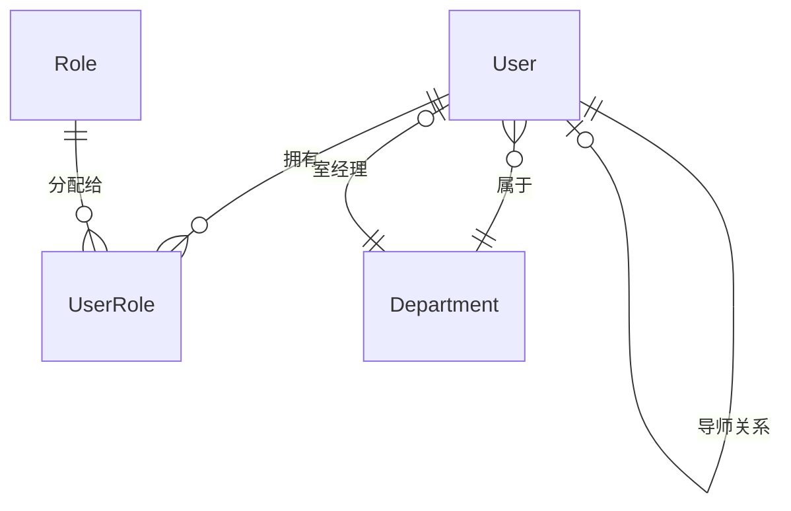
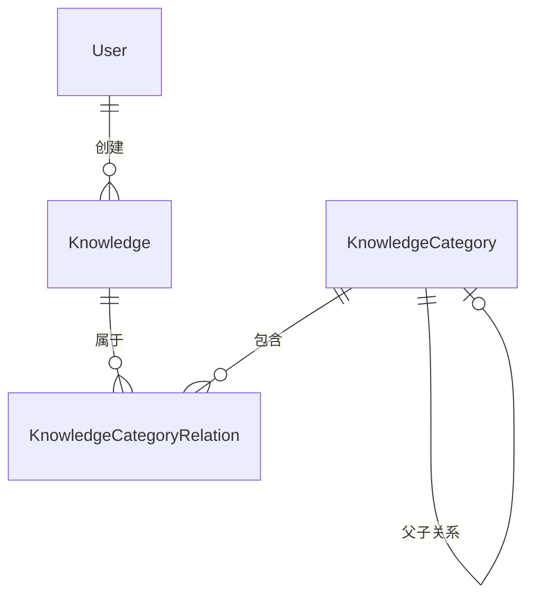
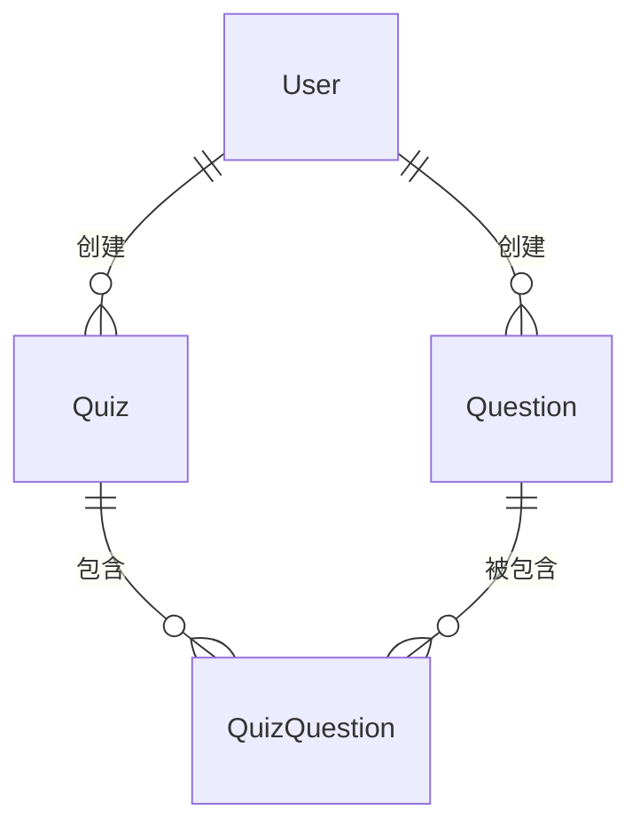
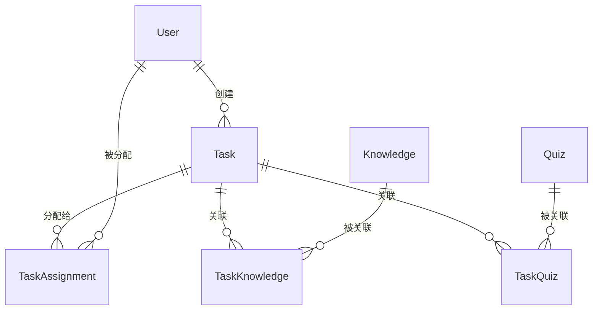
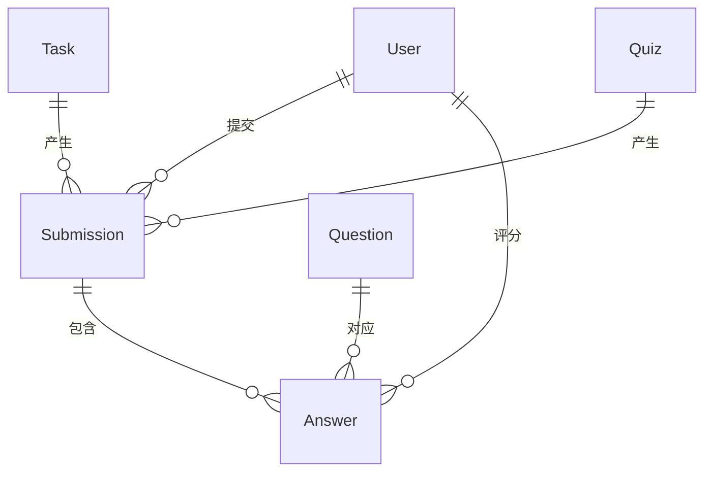
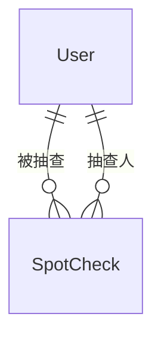
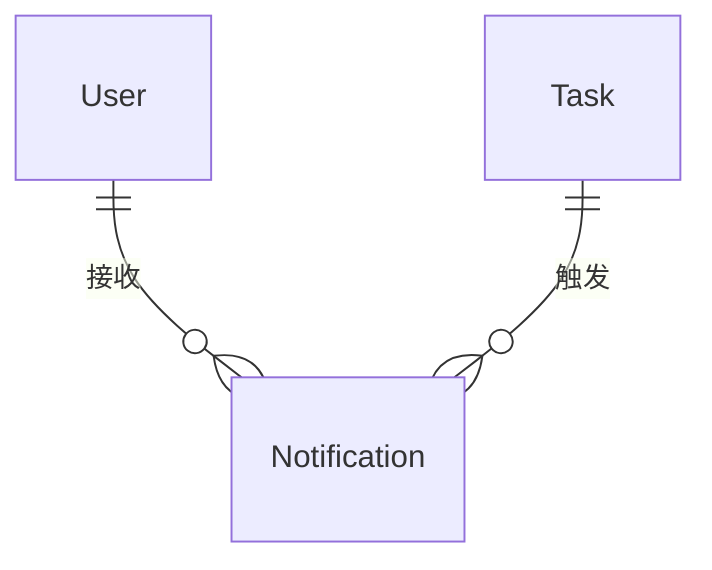
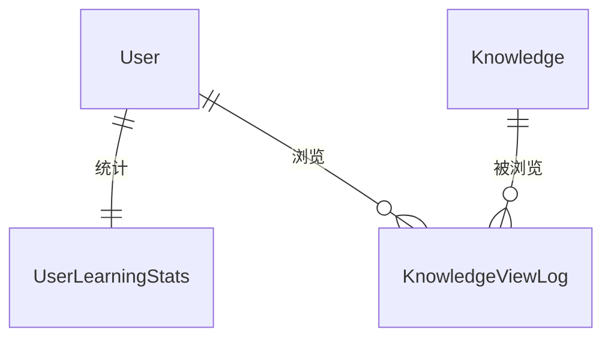

# 数据模型设计文档
# LMS 学习管理系统 - Database Schema Design

## 1. 概述

本文档定义了 LMS 学习管理系统的完整数据模型设计，基于 Django ORM 规范，支持 PostgreSQL 数据库。

**设计原则：**
- 资源与任务分离：知识库、测验作为资源，任务作为分配动作
- 多对多关系：用户-角色、任务-学员、测验-题目
- 软删除：关键数据支持软删除，保留历史记录
- 审计字段：所有表包含创建时间、更新时间、创建人、修改人

---

## 2. 核心实体关系（ER图）

### 2.1 实体关系概览

#### 2.1.1 用户与权限模块



#### 2.1.2 知识库模块



#### 2.1.3 题库与测验模块



#### 2.1.4 任务模块



#### 2.1.5 答题与评分模块



#### 2.1.6 现场抽查模块



#### 2.1.7 通知模块



#### 2.1.8 统计与日志模块



### 2.2 核心实体说明

#### 2.2.1 用户与权限域

**核心实体：**
- **User（用户）**：系统用户，支持多角色
- **Role（角色）**：系统角色（学员、导师、室经理、团队经理、管理员）
- **UserRole（用户角色关联）**：多对多关系，一个用户可拥有多个角色
- **Department（部门）**：组织架构（一室、二室）

**关系说明：**
- User ↔ Role：多对多，通过 UserRole 关联
- User → Department：多对一，用户属于某个部门
- Department → User：多对一，部门有一个室经理（manager_id）
- User → User：一对多，导师与学员的师徒关系（mentor_id）

#### 2.2.2 知识库域

**核心实体：**
- **Knowledge（知识文档）**：知识库的核心资源
- **KnowledgeCategory（知识分类）**：三级标签体系（一级/二级/操作标签）
- **KnowledgeCategoryRelation（知识分类关联）**：多对多关系

**关系说明：**
- Knowledge ↔ KnowledgeCategory：多对多，一篇知识可有多个标签
- KnowledgeCategory → KnowledgeCategory：自关联，支持三级分类

#### 2.2.3 题库与测验域

**核心实体：**
- **Question（题目）**：题库中的题目（单选/多选/判断/简答）
- **Quiz（测验/试卷）**：题目的容器，可复用的资源
- **QuizQuestion（测验题目关联）**：多对多关系，记录题目顺序和分值

**关系说明：**
- Quiz ↔ Question：多对多，一份测验包含多道题目
- QuizQuestion 记录：sort_order（题目顺序）、score（题目分值）

#### 2.2.4 任务域

**核心实体：**
- **Task（任务）**：学习/练习/考试任务
- **TaskAssignment（任务分配）**：任务与学员的关联，记录完成状态
- **TaskKnowledge（任务知识关联）**：学习任务、练习任务关联的知识文档
- **TaskQuiz（任务测验关联）**：练习任务、考试任务关联的测验

**关系说明：**
- Task → User：多对一，任务由某人创建
- Task ↔ User：多对多，通过 TaskAssignment 分配给多个学员
- Task ↔ Knowledge：多对多，通过 TaskKnowledge 关联
- Task ↔ Quiz：多对多，通过 TaskQuiz 关联

#### 2.2.5 答题与评分域

**核心实体：**
- **Submission（答题记录）**：学员对某个任务的答题记录
- **Answer（答案记录）**：每道题的答案和评分

**关系说明：**
- Submission → Task：多对一，答题记录属于某个任务
- Submission → Quiz：多对一，答题记录对应某份测验
- Submission → User：多对一，答题记录属于某个学员
- Submission ↔ Answer：一对多，一次答题包含多道题的答案
- Answer → Question：多对一，答案对应某道题目

#### 2.2.6 其他域

**现场抽查：**
- **SpotCheck（现场抽查）**：线下抽查记录
  - SpotCheck → User（被抽查人）：多对一
  - SpotCheck → User（抽查人）：多对一

**通知：**
- **Notification（通知）**：系统通知和外部通知
  - Notification → User：多对一，通知接收人
  - Notification → Task：多对一，关联任务（可选）

**统计与日志：**
- **UserLearningStats（用户学习统计）**：用户维度的统计数据
  - UserLearningStats → User：一对一
- **KnowledgeViewLog（知识浏览日志）**：知识浏览行为记录
  - KnowledgeViewLog → Knowledge：多对一
  - KnowledgeViewLog → User：多对一

### 2.3 关键业务流程的数据流

#### 2.3.1 学习任务流程

```
1. 创建任务：Task (type=LEARNING)
2. 关联知识：TaskKnowledge (task_id, knowledge_id)
3. 分配学员：TaskAssignment (task_id, user_id)
4. 学员学习：KnowledgeViewLog (knowledge_id, user_id)
5. 完成任务：TaskAssignment.status = COMPLETED
```

#### 2.3.2 练习/考试任务流程

```
1. 创建任务：Task (type=PRACTICE/EXAM)
2. 关联测验：TaskQuiz (task_id, quiz_id)
3. 关联知识（可选）：TaskKnowledge (task_id, knowledge_id)
4. 分配学员：TaskAssignment (task_id, user_id)
5. 学员答题：Submission (task_id, quiz_id, user_id)
6. 记录答案：Answer (submission_id, question_id, user_answer)
7. 客观题自动评分：Answer.is_correct, Answer.score
8. 主观题人工评分：Answer.graded_by, Answer.grader_comment
9. 完成评分：Submission.status = GRADED
10. 完成任务：TaskAssignment.status = COMPLETED
```

#### 2.3.3 现场抽查流程

```
1. 录入抽查：SpotCheck (user_id, topic, score, checked_by)
2. 更新统计：UserLearningStats (total_spot_checks, average_spot_score)
```

---

## 3. 数据表设计

### 3.1 用户与权限模块

#### 3.1.1 User (用户表)

继承 Django AbstractUser，扩展字段：

| 字段名 | 类型 | 说明 | 约束 |
|--------|------|------|------|
| id | BigAutoField | 主键 | PK |
| username | CharField(50) | 用户名 | Unique, Not Null |
| password | CharField(128) | 密码（加密） | Not Null |
| email | EmailField | 邮箱 | Unique, Nullable |
| phone | CharField(11) | 手机号 | Unique, Nullable |
| real_name | CharField(50) | 真实姓名 | Not Null |
| employee_id | CharField(20) | 工号 | Unique, Not Null |
| department_id | ForeignKey | 所属部门 | FK -> Department |
| mentor_id | ForeignKey | 导师 | FK -> User, Nullable |
| join_date | DateField | 入职日期 | Nullable |
| is_active | BooleanField | 是否激活 | Default: True |
| created_at | DateTimeField | 创建时间 | Auto |
| updated_at | DateTimeField | 更新时间 | Auto |

**索引：**
- idx_username
- idx_employee_id
- idx_department_id
- idx_mentor_id

---

#### 3.1.2 Role (角色表)

| 字段名 | 类型 | 说明 | 约束 |
|--------|------|------|------|
| id | AutoField | 主键 | PK |
| name | CharField(20) | 角色名称 | Unique, Not Null |
| code | CharField(20) | 角色代码 | Unique, Not Null |
| description | TextField | 角色描述 | Nullable |
| created_at | DateTimeField | 创建时间 | Auto |

**预置角色：**
- STUDENT (学员)
- MENTOR (导师)
- DEPT_MANAGER (室经理)
- TEAM_MANAGER (团队经理)
- ADMIN (管理员)

---

#### 3.1.3 UserRole (用户角色关联表)

| 字段名 | 类型 | 说明 | 约束 |
|--------|------|------|------|
| id | BigAutoField | 主键 | PK |
| user_id | ForeignKey | 用户 | FK -> User |
| role_id | ForeignKey | 角色 | FK -> Role |
| assigned_by | ForeignKey | 分配人 | FK -> User |
| assigned_at | DateTimeField | 分配时间 | Auto |

**索引：**
- unique_together: (user_id, role_id)
- idx_user_id
- idx_role_id

---

#### 3.1.4 Department (部门表)

| 字段名 | 类型 | 说明 | 约束 |
|--------|------|------|------|
| id | AutoField | 主键 | PK |
| name | CharField(50) | 部门名称 | Not Null |
| code | CharField(20) | 部门代码 | Unique, Not Null |
| manager_id | ForeignKey | 室经理 | FK -> User, Nullable |
| description | TextField | 部门描述 | Nullable |
| created_at | DateTimeField | 创建时间 | Auto |
| updated_at | DateTimeField | 更新时间 | Auto |

**预置部门：**
- DEPT_ONE (一室)
- DEPT_TWO (二室)

---

### 3.2 知识库模块

#### 3.2.1 KnowledgeCategory (知识分类表)

| 字段名 | 类型 | 说明 | 约束 |
|--------|------|------|------|
| id | AutoField | 主键 | PK |
| name | CharField(50) | 分类名称 | Not Null |
| code | CharField(20) | 分类代码 | Unique, Not Null |
| level | IntegerField | 层级 | 1/2/3 |
| parent_id | ForeignKey | 父分类 | FK -> Self, Nullable |
| sort_order | IntegerField | 排序 | Default: 0 |
| created_at | DateTimeField | 创建时间 | Auto |

**层级说明：**
- Level 1: 一级标签（双云、网络、数据库、应用、应急场景、规章制度）
- Level 2: 二级标签（手机银行、数字人民币、核心系统等）
- Level 3: 操作标签（重启、隔离、扩容、应急切换等）

**索引：**
- idx_parent_id
- idx_level

---

#### 3.2.2 Knowledge (知识文档表)

| 字段名 | 类型 | 说明 | 约束 |
|--------|------|------|------|
| id | BigAutoField | 主键 | PK |
| title | CharField(200) | 标题 | Not Null |
| content | TextField | 内容（Markdown/HTML） | Not Null |
| summary | CharField(500) | 摘要 | Nullable |
| file_url | CharField(500) | 附件URL（对象存储） | Nullable |
| view_count | IntegerField | 浏览次数 | Default: 0 |
| is_published | BooleanField | 是否发布 | Default: False |
| is_deleted | BooleanField | 软删除标记 | Default: False |
| created_by | ForeignKey | 创建人 | FK -> User |
| updated_by | ForeignKey | 修改人 | FK -> User |
| created_at | DateTimeField | 创建时间 | Auto |
| updated_at | DateTimeField | 更新时间 | Auto |

**索引：**
- idx_title (全文索引)
- idx_created_by
- idx_is_published
- idx_created_at

---

#### 3.2.3 KnowledgeCategoryRelation (知识分类关联表)

| 字段名 | 类型 | 说明 | 约束 |
|--------|------|------|------|
| id | BigAutoField | 主键 | PK |
| knowledge_id | ForeignKey | 知识文档 | FK -> Knowledge |
| category_id | ForeignKey | 分类 | FK -> KnowledgeCategory |
| created_at | DateTimeField | 创建时间 | Auto |

**索引：**
- unique_together: (knowledge_id, category_id)
- idx_knowledge_id
- idx_category_id

---

### 3.3 题库与测验模块

#### 3.3.1 Question (题目表)

| 字段名 | 类型 | 说明 | 约束 |
|--------|------|------|------|
| id | BigAutoField | 主键 | PK |
| type | CharField(20) | 题目类型 | SINGLE/MULTIPLE/JUDGE/ESSAY |
| content | TextField | 题干 | Not Null |
| options | JSONField | 选项（JSON数组） | Nullable |
| correct_answer | JSONField | 正确答案（JSON） | Not Null |
| analysis | TextField | 解析 | Nullable |
| difficulty | IntegerField | 难度 | 1-5 |
| is_public | BooleanField | 是否公开 | Default: False |
| is_deleted | BooleanField | 软删除标记 | Default: False |
| created_by | ForeignKey | 创建人 | FK -> User |
| created_at | DateTimeField | 创建时间 | Auto |
| updated_at | DateTimeField | 更新时间 | Auto |

**题目类型：**
- SINGLE: 单选题
- MULTIPLE: 多选题
- JUDGE: 判断题
- ESSAY: 简答题

**options 格式示例：**
```json
[
  {"key": "A", "value": "选项A内容"},
  {"key": "B", "value": "选项B内容"},
  {"key": "C", "value": "选项C内容"},
  {"key": "D", "value": "选项D内容"}
]
```

**correct_answer 格式示例：**
```json
// 单选/判断
{"answer": "A"}

// 多选
{"answer": ["A", "C"]}

// 简答（参考答案）
{"answer": "参考答案内容"}
```

**索引：**
- idx_type
- idx_created_by
- idx_difficulty

---

#### 3.3.2 Quiz (测验/试卷表)

| 字段名 | 类型 | 说明 | 约束 |
|--------|------|------|------|
| id | BigAutoField | 主键 | PK |
| title | CharField(200) | 测验标题 | Not Null |
| description | TextField | 测验描述 | Nullable |
| total_score | DecimalField(5,2) | 总分 | Default: 100 |
| pass_score | DecimalField(5,2) | 及格分 | Default: 60 |
| is_public | BooleanField | 是否公开 | Default: False |
| is_deleted | BooleanField | 软删除标记 | Default: False |
| created_by | ForeignKey | 创建人 | FK -> User |
| created_at | DateTimeField | 创建时间 | Auto |
| updated_at | DateTimeField | 更新时间 | Auto |

**索引：**
- idx_title
- idx_created_by
- idx_is_public

---

#### 3.3.3 QuizQuestion (测验题目关联表)

| 字段名 | 类型 | 说明 | 约束 |
|--------|------|------|------|
| id | BigAutoField | 主键 | PK |
| quiz_id | ForeignKey | 测验 | FK -> Quiz |
| question_id | ForeignKey | 题目 | FK -> Question |
| sort_order | IntegerField | 题目顺序 | Not Null |
| score | DecimalField(5,2) | 题目分值 | Not Null |
| created_at | DateTimeField | 创建时间 | Auto |

**索引：**
- unique_together: (quiz_id, question_id)
- idx_quiz_id
- idx_sort_order

---

### 3.4 任务模块

#### 3.4.1 Task (任务表)

| 字段名 | 类型 | 说明 | 约束 |
|--------|------|------|------|
| id | BigAutoField | 主键 | PK |
| title | CharField(200) | 任务标题 | Not Null |
| description | TextField | 任务描述 | Nullable |
| type | CharField(20) | 任务类型 | LEARNING/PRACTICE/EXAM |
| start_time | DateTimeField | 开始时间 | Nullable |
| deadline | DateTimeField | 截止时间 | Not Null |
| allow_retake | BooleanField | 允许重做 | Default: False |
| anti_cheat_enabled | BooleanField | 防作弊开关 | Default: False |
| status | CharField(20) | 任务状态 | DRAFT/PUBLISHED/CLOSED |
| is_deleted | BooleanField | 软删除标记 | Default: False |
| created_by | ForeignKey | 创建人 | FK -> User |
| created_at | DateTimeField | 创建时间 | Auto |
| updated_at | DateTimeField | 更新时间 | Auto |

**任务类型：**
- LEARNING: 学习任务
- PRACTICE: 练习任务
- EXAM: 考试任务

**任务状态：**
- DRAFT: 草稿
- PUBLISHED: 已发布
- CLOSED: 已关闭

**索引：**
- idx_type
- idx_status
- idx_created_by
- idx_deadline

---

#### 3.4.2 TaskKnowledge (任务知识关联表)

用于学习任务和练习任务的关联知识

| 字段名 | 类型 | 说明 | 约束 |
|--------|------|------|------|
| id | BigAutoField | 主键 | PK |
| task_id | ForeignKey | 任务 | FK -> Task |
| knowledge_id | ForeignKey | 知识文档 | FK -> Knowledge |
| is_required | BooleanField | 是否必读 | Default: True |
| created_at | DateTimeField | 创建时间 | Auto |

**索引：**
- unique_together: (task_id, knowledge_id)
- idx_task_id
- idx_knowledge_id

---

#### 3.4.3 TaskQuiz (任务测验关联表)

用于练习任务和考试任务的关联测验

| 字段名 | 类型 | 说明 | 约束 |
|--------|------|------|------|
| id | BigAutoField | 主键 | PK |
| task_id | ForeignKey | 任务 | FK -> Task |
| quiz_id | ForeignKey | 测验 | FK -> Quiz |
| created_at | DateTimeField | 创建时间 | Auto |

**索引：**
- unique_together: (task_id, quiz_id)
- idx_task_id
- idx_quiz_id

---

#### 3.4.4 TaskAssignment (任务分配表)

| 字段名 | 类型 | 说明 | 约束 |
|--------|------|------|------|
| id | BigAutoField | 主键 | PK |
| task_id | ForeignKey | 任务 | FK -> Task |
| user_id | ForeignKey | 学员 | FK -> User |
| status | CharField(20) | 完成状态 | NOT_STARTED/IN_PROGRESS/COMPLETED/OVERDUE |
| started_at | DateTimeField | 开始时间 | Nullable |
| completed_at | DateTimeField | 完成时间 | Nullable |
| created_at | DateTimeField | 分配时间 | Auto |

**完成状态：**
- NOT_STARTED: 未开始
- IN_PROGRESS: 进行中
- COMPLETED: 已完成
- OVERDUE: 已逾期

**索引：**
- unique_together: (task_id, user_id)
- idx_task_id
- idx_user_id
- idx_status

---

### 3.5 答题与评分模块

#### 3.5.1 Submission (答题记录表)

| 字段名 | 类型 | 说明 | 约束 |
|--------|------|------|------|
| id | BigAutoField | 主键 | PK |
| task_id | ForeignKey | 任务 | FK -> Task |
| quiz_id | ForeignKey | 测验 | FK -> Quiz |
| user_id | ForeignKey | 学员 | FK -> User |
| attempt_number | IntegerField | 第几次尝试 | Default: 1 |
| total_score | DecimalField(5,2) | 总分 | Nullable |
| obtained_score | DecimalField(5,2) | 得分 | Nullable |
| correct_count | IntegerField | 答对题数 | Default: 0 |
| total_time | IntegerField | 总用时（秒） | Nullable |
| status | CharField(20) | 评分状态 | SUBMITTED/GRADING/GRADED |
| submitted_at | DateTimeField | 提交时间 | Auto |
| graded_at | DateTimeField | 评分完成时间 | Nullable |

**评分状态：**
- SUBMITTED: 已提交
- GRADING: 评分中（有主观题待评）
- GRADED: 已评分

**索引：**
- idx_task_id
- idx_user_id
- idx_quiz_id
- idx_status
- unique_together: (task_id, user_id, attempt_number)

---

#### 3.5.2 Answer (答案记录表)

| 字段名 | 类型 | 说明 | 约束 |
|--------|------|------|------|
| id | BigAutoField | 主键 | PK |
| submission_id | ForeignKey | 答题记录 | FK -> Submission |
| question_id | ForeignKey | 题目 | FK -> Question |
| user_answer | JSONField | 学员答案 | Not Null |
| is_correct | BooleanField | 是否正确 | Nullable |
| score | DecimalField(5,2) | 得分 | Nullable |
| graded_by | ForeignKey | 评分人 | FK -> User, Nullable |
| grader_comment | TextField | 评语 | Nullable |
| graded_at | DateTimeField | 评分时间 | Nullable |
| created_at | DateTimeField | 答题时间 | Auto |

**user_answer 格式示例：**
```json
// 单选/判断
{"answer": "A"}

// 多选
{"answer": ["A", "C"]}

// 简答
{"answer": "学员的答案内容"}
```

**索引：**
- idx_submission_id
- idx_question_id
- idx_is_correct

---

### 3.6 现场抽查模块

#### 3.6.1 SpotCheck (现场抽查表)

| 字段名 | 类型 | 说明 | 约束 |
|--------|------|------|------|
| id | BigAutoField | 主键 | PK |
| user_id | ForeignKey | 被抽查学员 | FK -> User |
| topic | CharField(200) | 抽查主题 | Not Null |
| score | IntegerField | 评分 | 1-10 |
| comment | TextField | 评语 | Nullable |
| checked_by | ForeignKey | 抽查人 | FK -> User |
| checked_at | DateTimeField | 抽查时间 | Auto |
| created_at | DateTimeField | 创建时间 | Auto |

**索引：**
- idx_user_id
- idx_checked_by
- idx_checked_at

---

### 3.7 通知模块

#### 3.7.1 Notification (通知表)

| 字段名 | 类型 | 说明 | 约束 |
|--------|------|------|------|
| id | BigAutoField | 主键 | PK |
| type | CharField(20) | 通知类型 | TASK_ASSIGNED/DEADLINE_REMINDER/GRADED |
| title | CharField(200) | 通知标题 | Not Null |
| content | TextField | 通知内容 | Not Null |
| recipient_id | ForeignKey | 接收人 | FK -> User |
| related_task_id | ForeignKey | 关联任务 | FK -> Task, Nullable |
| is_read | BooleanField | 是否已读 | Default: False |
| external_sent | BooleanField | 是否已发送外部通知 | Default: False |
| external_status | CharField(20) | 外部发送状态 | PENDING/SUCCESS/FAILED |
| created_at | DateTimeField | 创建时间 | Auto |

**通知类型：**
- TASK_ASSIGNED: 任务分配
- DEADLINE_REMINDER: 截止提醒
- GRADED: 评分完成
- SPOT_CHECK: 现场抽查

**索引：**
- idx_recipient_id
- idx_type
- idx_is_read
- idx_created_at

---

### 3.8 统计与日志模块

#### 3.8.1 UserLearningStats (用户学习统计表)

| 字段名 | 类型 | 说明 | 约束 |
|--------|------|------|------|
| id | BigAutoField | 主键 | PK |
| user_id | ForeignKey | 用户 | FK -> User, Unique |
| total_tasks | IntegerField | 总任务数 | Default: 0 |
| completed_tasks | IntegerField | 完成任务数 | Default: 0 |
| total_learning_time | IntegerField | 总学习时长（分钟） | Default: 0 |
| total_score | DecimalField(10,2) | 总得分 | Default: 0 |
| average_score | DecimalField(5,2) | 平均分 | Default: 0 |
| total_spot_checks | IntegerField | 总抽查次数 | Default: 0 |
| average_spot_score | DecimalField(5,2) | 平均抽查分 | Default: 0 |
| updated_at | DateTimeField | 更新时间 | Auto |

**索引：**
- idx_user_id (Unique)
- idx_average_score

---

#### 3.8.2 KnowledgeViewLog (知识浏览日志表)

| 字段名 | 类型 | 说明 | 约束 |
|--------|------|------|------|
| id | BigAutoField | 主键 | PK |
| knowledge_id | ForeignKey | 知识文档 | FK -> Knowledge |
| user_id | ForeignKey | 用户 | FK -> User |
| task_id | ForeignKey | 关联任务 | FK -> Task, Nullable |
| view_duration | IntegerField | 浏览时长（秒） | Nullable |
| created_at | DateTimeField | 浏览时间 | Auto |

**索引：**
- idx_knowledge_id
- idx_user_id
- idx_created_at

---

---

## 4. 数据字典补充说明

### 4.1 软删除策略

以下表支持软删除（is_deleted 字段）：
- Knowledge (知识文档)
- Question (题目)
- Quiz (测验)
- Task (任务)

软删除的数据不会在列表中显示，但保留在数据库中用于审计和恢复。

### 4.2 审计字段

所有核心业务表包含以下审计字段：
- created_at: 创建时间（自动）
- updated_at: 更新时间（自动）
- created_by: 创建人（部分表）
- updated_by: 修改人（部分表）

### 4.3 JSON 字段说明

使用 JSONField 的字段：
- Question.options: 题目选项
- Question.correct_answer: 正确答案
- Answer.user_answer: 学员答案

建议使用 PostgreSQL 的 JSONB 类型以获得更好的查询性能。

### 4.4 对象存储字段

以下字段存储对象存储的 URL：
- Knowledge.file_url: 知识文档附件
- 未来可扩展：SpotCheck.photo_url (现场抽查照片)

---

## 5. 索引策略

### 5.1 单列索引

高频查询字段：
- 所有外键字段
- status 状态字段
- type 类型字段
- created_at 时间字段

### 5.2 复合索引

常见组合查询：
- (task_id, user_id) - 任务分配查询
- (user_id, status) - 用户任务状态查询
- (quiz_id, sort_order) - 测验题目排序

### 5.3 唯一索引

业务唯一性约束：
- (user_id, role_id) - 用户角色唯一
- (task_id, user_id) - 任务分配唯一
- (quiz_id, question_id) - 测验题目唯一

---

## 6. 数据迁移建议

### 6.1 初始化数据

系统启动时需要初始化：
1. 角色数据（5个预置角色）
2. 部门数据（一室、二室）
3. 知识分类数据（三级标签体系）
4. 管理员账号

### 6.2 批量导入

支持批量导入的数据：
- 用户数据（Excel）
- 题目数据（Excel）
- 知识文档（Markdown/HTML 文件）

### 6.3 数据备份

建议备份策略：
- 每日全量备份
- 关键操作前手动备份
- 保留最近 30 天备份

---

**文档版本：** v1.0  
**创建日期：** 2025-12-12  
**最后更新：** 2025-12-12  
**负责人：** [待填写]
