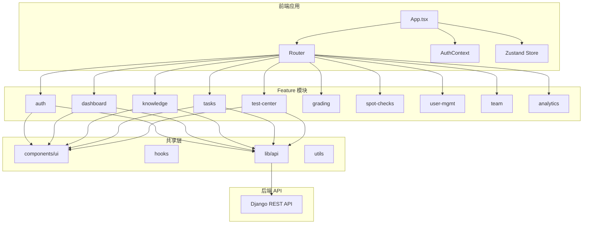

# LMS 前端设计文档

## Overview

本设计文档描述 LMS（学习管理系统）前端的技术架构和实现方案。系统采用 React + TypeScript + Tailwind CSS 构建，与 Django REST Framework 后端 API 对接，实现"学、练、考、评"的能力闭环。

### 核心设计原则

1. **Feature-Based 架构**：按业务功能划分模块，每个 feature 独立自治
2. **基于角色的 UI 控制**：根据用户角色动态展示菜单、路由和功能
3. **状态管理分层**：服务端状态使用 React Query，客户端状态使用 Zustand
4. **组件复用**：通用 UI 组件抽象到 components/ui 目录

### 技术栈

- **框架**: React 19 + TypeScript
- **路由**: React Router v7
- **样式**: Tailwind CSS
- **状态管理**: Zustand (客户端状态) + React Query (服务端状态)
- **表单验证**: Zod
- **HTTP 客户端**: Fetch API (封装)
- **图标**: Lucide React
- **日期处理**: date-fns


---

## Architecture

### 系统架构图



### 目录结构

```
src/
├── app/                          # 应用层配置
│   ├── layouts/                  # 布局组件
│   │   ├── MainLayout.tsx        # 主布局（侧边栏+顶栏）
│   │   ├── AuthLayout.tsx        # 认证页面布局
│   │   └── index.ts
│   ├── routes/                   # 路由配置
│   │   ├── index.tsx             # 路由定义
│   │   ├── guards.tsx            # 路由守卫
│   │   └── role-routes.ts        # 角色路由映射
│   └── provider.tsx              # 全局 Provider
│
├── components/                   # 全局共享组件
│   ├── ui/                       # 基础 UI 组件
│   │   ├── Button.tsx
│   │   ├── Input.tsx
│   │   ├── Select.tsx
│   │   ├── Card.tsx
│   │   ├── Modal.tsx
│   │   ├── Table.tsx
│   │   ├── Badge.tsx
│   │   ├── Toast.tsx
│   │   ├── Spinner.tsx
│   │   └── index.ts
│   └── layout/                   # 布局组件
│       ├── Sidebar.tsx
│       ├── Header.tsx
│       └── index.ts
│
├── config/                       # 全局配置
│   ├── index.ts                  # 环境变量
│   ├── api.ts                    # API 配置
│   └── roles.ts                  # 角色配置
│
├── features/                     # 功能模块
│   ├── auth/                     # 认证模块
│   ├── dashboard/                # 仪表盘
│   ├── knowledge/                # 知识中心
│   ├── tasks/                    # 任务中心
│   ├── test-center/              # 测试中心
│   ├── grading/                  # 评分中心
│   ├── spot-checks/              # 抽查中心
│   ├── user-mgmt/                # 用户管理
│   ├── team/                     # 团队数据
│   └── analytics/                # 个人中心/统计
│
├── hooks/                        # 全局 Hooks
│   ├── useAuth.ts
│   ├── useRole.ts
│   └── useToast.ts
│
├── lib/                          # 第三方库封装
│   ├── api.ts                    # API 客户端
│   └── query-client.ts           # React Query 配置
│
├── stores/                       # 全局状态
│   ├── auth.ts                   # 认证状态
│   └── ui.ts                     # UI 状态
│
├── types/                        # 全局类型
│   ├── domain.ts                 # 业务类型
│   ├── api.ts                    # API 类型
│   └── index.ts
│
└── utils/                        # 工具函数
    ├── cn.ts                     # className 合并
    ├── date.ts                   # 日期格式化
    └── storage.ts                # 本地存储
```


---

## Components and Interfaces

### 1. 认证模块 (auth)

#### 组件结构

```
features/auth/
├── api/
│   ├── auth.ts                   # 认证 API
│   └── index.ts
├── components/
│   ├── LoginForm.tsx             # 登录表单
│   ├── RoleSwitcher.tsx          # 角色切换器
│   └── index.ts
├── hooks/
│   └── useAuth.ts                # 认证 Hook
├── types/
│   └── index.ts
├── AuthContext.tsx               # 认证上下文
├── LoginPage.tsx                 # 登录页面
└── index.ts
```

#### API 接口

```typescript
// 登录
POST /api/auth/login/
Request: { username: string; password: string }
Response: { access_token: string; refresh_token: string; user: User; available_roles: Role[]; current_role: string }

// 登出
POST /api/auth/logout/
Request: { refresh_token?: string }

// 刷新令牌
POST /api/auth/refresh/
Request: { refresh_token: string }
Response: { access_token: string }

// 切换角色
POST /api/auth/switch-role/
Request: { role_code: string }
Response: { access_token: string; refresh_token: string; current_role: string }
```

### 2. 仪表盘模块 (dashboard)

#### 组件结构

```
features/dashboard/
├── api/
│   └── dashboard.ts
├── components/
│   ├── StudentDashboard.tsx      # 学员仪表盘
│   ├── MentorDashboard.tsx       # 导师仪表盘
│   ├── PendingTaskList.tsx       # 待办任务列表
│   ├── LatestKnowledge.tsx       # 最新知识
│   ├── StatsCard.tsx             # 统计卡片
│   └── QuickActions.tsx          # 快捷操作
├── Dashboard.tsx                 # 仪表盘路由组件
└── index.ts
```

### 3. 知识中心模块 (knowledge)

#### 组件结构

```
features/knowledge/
├── api/
│   └── knowledge.ts
├── components/
│   ├── KnowledgeList.tsx         # 知识列表
│   ├── KnowledgeCard.tsx         # 知识卡片
│   ├── KnowledgeDetail.tsx       # 知识详情
│   ├── CategoryFilter.tsx        # 分类筛选器
│   ├── TableOfContents.tsx       # 内容目录
│   ├── EmergencyContent.tsx      # 应急类内容展示
│   ├── MarkdownContent.tsx       # Markdown 内容展示
│   └── KnowledgeForm.tsx         # 知识编辑表单（管理员）
├── KnowledgeCenter.tsx           # 学员知识中心
├── KnowledgeManagement.tsx       # 管理员知识管理
└── index.ts
```

### 4. 任务中心模块 (tasks)

#### 组件结构

```
features/tasks/
├── api/
│   └── tasks.ts
├── components/
│   ├── TaskList.tsx              # 任务列表
│   ├── TaskCard.tsx              # 任务卡片
│   ├── TaskFilter.tsx            # 任务筛选器
│   ├── LearningTaskDetail.tsx    # 学习任务详情
│   ├── PracticeTaskDetail.tsx    # 练习任务详情
│   ├── ExamTaskDetail.tsx        # 考试任务详情
│   ├── TaskWizard/               # 任务创建向导
│   │   ├── TaskWizard.tsx
│   │   ├── StepBasicInfo.tsx     # 第一步：基本信息
│   │   ├── StepResources.tsx     # 第二步：资源选择
│   │   ├── StepAssignees.tsx     # 第三步：学员选择
│   │   └── index.ts
│   ├── KnowledgeProgress.tsx     # 知识学习进度
│   └── QuizProgress.tsx          # 试卷完成进度
├── TaskCenter.tsx                # 学员任务中心
├── TaskManagement.tsx            # 任务管理（导师/管理员）
├── PracticeRunner.tsx            # 练习答题界面
├── ExamRunner.tsx                # 考试答题界面
└── index.ts
```

### 5. 测试中心模块 (test-center)

#### 组件结构

```
features/test-center/
├── api/
│   ├── questions.ts
│   └── quizzes.ts
├── components/
│   ├── QuestionList.tsx          # 题目列表
│   ├── QuestionForm.tsx          # 题目表单
│   ├── QuestionCard.tsx          # 题目卡片
│   ├── QuizList.tsx              # 试卷列表
│   ├── QuizForm.tsx              # 试卷表单
│   ├── QuizBuilder.tsx           # 试卷构建器
│   ├── QuestionPicker.tsx        # 题目选择器
│   ├── QuickPublish.tsx          # 快速发布弹窗
│   └── ImportQuestions.tsx       # 批量导入
├── QuestionManagement.tsx        # 题目管理页
├── QuizManagement.tsx            # 试卷管理页
├── TestCenter.tsx                # 测试中心入口
└── index.ts
```

### 6. 评分中心模块 (grading)

#### 组件结构

```
features/grading/
├── api/
│   └── grading.ts
├── components/
│   ├── PendingList.tsx           # 待评分列表
│   ├── GradingDetail.tsx         # 评分详情
│   ├── AnswerCard.tsx            # 答案卡片
│   ├── ScoreInput.tsx            # 评分输入
│   └── CommentInput.tsx          # 评语输入
├── GradingCenter.tsx             # 评分中心页
└── index.ts
```

### 7. 用户管理模块 (user-mgmt)

#### 组件结构

```
features/user-mgmt/
├── api/
│   └── users.ts
├── components/
│   ├── UserList.tsx              # 用户列表
│   ├── UserForm.tsx              # 用户表单
│   ├── UserDetail.tsx            # 用户详情
│   ├── RoleSelector.tsx          # 角色选择器
│   ├── DepartmentTree.tsx        # 组织架构树
│   ├── MentorshipList.tsx        # 师徒关系列表
│   └── AssignMentor.tsx          # 指定导师
├── UserDirectory.tsx             # 用户目录页
├── OrganizationView.tsx          # 组织架构页
├── MentorshipView.tsx            # 师徒关系页
└── index.ts
```


---

## Data Models

### 核心类型定义

```typescript
// 用户相关
interface User {
  id: number;
  username: string;
  real_name: string;
  employee_id: string;
  department: Department;
  mentor?: User;
  is_active: boolean;
  roles: Role[];
}

interface Role {
  code: 'STUDENT' | 'MENTOR' | 'DEPT_MANAGER' | 'ADMIN' | 'TEAM_MANAGER';
  name: string;
}

interface Department {
  id: number;
  name: string;
  manager?: User;
}

// 知识相关
interface Knowledge {
  id: number;
  title: string;
  summary: string;
  knowledge_type: 'EMERGENCY' | 'OTHER';
  primary_category: KnowledgeCategory;
  secondary_category?: KnowledgeCategory;
  operation_tags: string[];
  content?: string;                    // OTHER 类型
  emergency_content?: EmergencyContent; // EMERGENCY 类型
  created_by: User;
  updated_at: string;
  view_count: number;
}

interface EmergencyContent {
  fault_scenario?: string;
  trigger_process?: string;
  solution?: string;
  verification?: string;
  recovery?: string;
}

interface KnowledgeCategory {
  id: number;
  name: string;
  level: 1 | 2;
  parent_id?: number;
  children?: KnowledgeCategory[];
}

// 题目相关
interface Question {
  id: number;
  type: 'SINGLE_CHOICE' | 'MULTIPLE_CHOICE' | 'TRUE_FALSE' | 'SHORT_ANSWER';
  content: string;
  options?: QuestionOption[];
  answer: string | string[];
  explanation: string;
  created_by: User;
}

interface QuestionOption {
  key: string;
  content: string;
}

// 试卷相关
interface Quiz {
  id: number;
  title: string;
  description?: string;
  questions: QuizQuestion[];
  total_score: number;
  created_by: User;
}

interface QuizQuestion {
  question: Question;
  order: number;
  score: number;
}

// 任务相关
interface Task {
  id: number;
  title: string;
  description?: string;
  type: 'LEARNING' | 'PRACTICE' | 'EXAM';
  status: 'ACTIVE' | 'CLOSED';
  deadline: string;
  start_time?: string;        // 考试任务
  duration?: number;          // 考试时长（分钟）
  pass_score?: number;        // 及格分数
  created_by: User;
  knowledge_items?: Knowledge[];
  quizzes?: Quiz[];
}

interface TaskAssignment {
  id: number;
  task: Task;
  user: User;
  status: 'IN_PROGRESS' | 'COMPLETED' | 'OVERDUE' | 'PENDING_EXAM';
  progress: number;           // 0-100
  completed_at?: string;
}

// 答题相关
interface Submission {
  id: number;
  task: Task;
  quiz: Quiz;
  user: User;
  attempt_number: number;
  status: 'SUBMITTED' | 'GRADING' | 'GRADED';
  total_score: number;
  obtained_score?: number;
  answers: Answer[];
  submitted_at: string;
}

interface Answer {
  id: number;
  question: Question;
  user_answer: string | string[];
  is_correct?: boolean;
  score?: number;
  graded_by?: User;
  comment?: string;
}

// 抽查相关
interface SpotCheck {
  id: number;
  student: User;
  content: string;
  score: number;
  comment?: string;
  checked_by: User;
  checked_at: string;
}
```

### 状态管理

```typescript
// stores/auth.ts - 认证状态
interface AuthState {
  user: User | null;
  currentRole: string | null;
  accessToken: string | null;
  refreshToken: string | null;
  isAuthenticated: boolean;
  
  login: (credentials: LoginCredentials) => Promise<void>;
  logout: () => void;
  switchRole: (roleCode: string) => Promise<void>;
  refreshAccessToken: () => Promise<void>;
}

// stores/ui.ts - UI 状态
interface UIState {
  sidebarCollapsed: boolean;
  theme: 'light' | 'dark';
  
  toggleSidebar: () => void;
  setTheme: (theme: 'light' | 'dark') => void;
}
```


---

## Correctness Properties

*A property is a characteristic or behavior that should hold true across all valid executions of a system-essentially, a formal statement about what the system should do. Properties serve as the bridge between human-readable specifications and machine-verifiable correctness guarantees.*

基于需求文档的验收标准分析，以下是前端必须满足的正确性属性。

### 认证属性

**Property 1: 登录成功后角色路由映射**
*For any* 用户角色，登录成功后应该跳转到该角色对应的默认仪表盘路由。
**Validates: Requirements 1.3**

**Property 2: 登出清除认证状态**
*For any* 登出操作，本地存储的 accessToken、refreshToken 和用户信息应该被完全清除。
**Validates: Requirements 1.5**

**Property 3: 令牌自动刷新**
*For any* 访问令牌过期的 API 请求，系统应该自动使用刷新令牌获取新的访问令牌并重试请求。
**Validates: Requirements 1.6**

### 角色切换属性

**Property 4: 高权限用户角色切换器可见性**
*For any* 拥有多个角色的用户，顶部导航栏应该展示角色切换器；仅有学员角色的用户不展示。
**Validates: Requirements 2.1, 2.6**

**Property 5: 角色切换后菜单一致性**
*For any* 角色切换操作，切换后的侧边栏菜单应该与新角色的权限配置完全匹配。
**Validates: Requirements 2.4, 3.1**

**Property 6: 角色切换状态清除**
*For any* 角色切换操作，前一角色的页面状态（如筛选条件、表单数据）应该被清除。
**Validates: Requirements 2.5**

### 路由权限属性

**Property 7: 角色菜单映射**
*For any* 角色，侧边栏菜单项应该与该角色的权限配置一一对应：
- 学员：仪表盘、知识中心、任务中心、个人中心
- 导师/室经理：仪表盘、测试中心、任务管理、评分中心、抽查中心
- 管理员：测试中心、知识库管理、任务管理、用户与权限
- 团队经理：团队数据看板
**Validates: Requirements 3.2, 3.3, 3.4, 3.5**

**Property 8: 无权限路由拦截**
*For any* 用户访问其当前角色无权限的路由，应该被重定向到 403 页面或有权限的默认页面。
**Validates: Requirements 3.6**

### 知识中心属性

**Property 9: 分类筛选联动**
*For any* 一级分类选择，二级分类选项应该动态更新为该一级分类下的子分类。
**Validates: Requirements 5.2, 5.3**

**Property 10: 知识类型内容展示**
*For any* 知识文档，应急类（EMERGENCY）展示结构化字段，其他类型（OTHER）展示 Markdown 内容。
**Validates: Requirements 5.6, 5.7**

### 任务执行属性

**Property 11: 学习任务完成状态**
*For any* 学习任务，当所有知识子任务都标记为已完成时，任务整体状态应该变为已完成。
**Validates: Requirements 7.6**

**Property 12: 练习任务重做允许**
*For any* 练习任务的试卷，无论完成状态如何，学员都应该能够再次作答。
**Validates: Requirements 8.7**

**Property 13: 考试时间窗口控制**
*For any* 考试任务，当前时间不在 [start_time, deadline] 范围内时，「进入考试」按钮应该被禁用。
**Validates: Requirements 9.3, 9.4**

**Property 14: 考试单次提交限制**
*For any* 已提交的考试任务，应该禁止重新作答，仅展示「查看结果」按钮。
**Validates: Requirements 9.8**

### 资源权限属性

**Property 15: 题目所有权编辑控制**
*For any* 非管理员用户查看的题目列表，非自己创建的题目应该隐藏编辑/删除按钮；管理员可见所有操作按钮。
**Validates: Requirements 12.5, 12.6**

**Property 16: 试卷所有权编辑控制**
*For any* 非管理员用户查看的试卷列表，非自己创建的试卷应该隐藏编辑/删除按钮；管理员可见所有操作按钮。
**Validates: Requirements 13.5, 13.6**

### 任务创建属性

**Property 17: 学员选择范围限制**
*For any* 任务创建操作：
- 导师只能看到并选择其名下学员
- 室经理只能看到并选择本室学员
- 管理员可以看到并选择全平台学员
**Validates: Requirements 14.10, 14.11, 14.12**

**Property 18: 快速发布任务类型限制**
*For any* 试卷快速发布操作，勾选多个试卷时仅允许选择练习任务类型。
**Validates: Requirements 13.11, 13.12**

### 抽查属性

**Property 19: 抽查学员范围限制**
*For any* 抽查记录创建：
- 导师只能选择其名下学员
- 室经理只能选择本室学员
**Validates: Requirements 16.4, 16.5**

### 团队经理属性

**Property 20: 团队经理只读视图**
*For any* 团队经理角色访问的页面，应该隐藏所有编辑、创建、删除操作按钮。
**Validates: Requirements 20.4**

### 用户管理属性

**Property 21: 学员角色不可移除**
*For any* 用户角色配置操作，学员角色选项应该始终被选中且不可取消。
**Validates: Requirements 18.7**


---

## Error Handling

### 错误类型

| 类型 | 描述 | 处理方式 |
|------|------|----------|
| 网络错误 | 无法连接到服务器 | 展示网络错误提示，提供重试按钮 |
| 认证错误 (401) | 令牌无效或过期 | 尝试刷新令牌，失败则跳转登录页 |
| 权限错误 (403) | 无权访问资源 | 展示权限不足提示，跳转到有权限页面 |
| 资源不存在 (404) | 请求的资源不存在 | 展示 404 页面或提示 |
| 业务错误 (400) | 业务规则违反 | 展示具体错误信息 |
| 服务器错误 (500) | 服务器内部错误 | 展示通用错误提示 |

### 错误展示组件

```typescript
// 全局错误边界
<ErrorBoundary fallback={<ErrorPage />}>
  <App />
</ErrorBoundary>

// Toast 提示
toast.error('操作失败：' + error.message);

// 表单字段错误
<Input error={errors.username?.message} />

// 页面级错误
<ErrorState 
  title="加载失败" 
  message={error.message}
  onRetry={refetch}
/>
```

### API 错误处理

```typescript
// lib/api.ts
async function request<T>(url: string, options?: RequestInit): Promise<T> {
  try {
    const response = await fetch(url, options);
    
    if (response.status === 401) {
      // 尝试刷新令牌
      const refreshed = await refreshToken();
      if (!refreshed) {
        // 跳转登录
        window.location.href = '/login';
        throw new Error('认证已过期');
      }
      // 重试请求
      return request(url, options);
    }
    
    if (!response.ok) {
      const error = await response.json();
      throw new ApiError(error.message, response.status, error.code);
    }
    
    return response.json();
  } catch (error) {
    if (error instanceof ApiError) throw error;
    throw new NetworkError('网络连接失败');
  }
}
```

---

## Testing Strategy

### 测试框架

- **单元测试**: Vitest
- **组件测试**: React Testing Library
- **属性测试**: fast-check
- **E2E 测试**: Playwright (可选)

### 双重测试方法

本项目采用单元测试和属性测试相结合的方法：

1. **单元测试**：验证具体示例和边界情况
   - 组件渲染测试
   - 用户交互测试
   - API 调用测试

2. **属性测试**：验证跨所有输入的通用属性
   - 使用 fast-check 库生成随机测试数据
   - 每个属性测试运行至少 100 次迭代
   - 测试注释必须引用设计文档中的正确性属性

### 属性测试标注格式

每个属性测试必须使用以下格式标注：

```typescript
// **Feature: lms-frontend, Property 5: 角色切换后菜单一致性**
test.prop([fc.constantFrom('STUDENT', 'MENTOR', 'DEPT_MANAGER', 'ADMIN', 'TEAM_MANAGER')])(
  'menu items match role permissions',
  (role) => {
    /**
     * Validates: Requirements 2.4, 3.1
     */
    const menuItems = getMenuItemsForRole(role);
    const expectedItems = ROLE_MENU_CONFIG[role];
    expect(menuItems).toEqual(expectedItems);
  }
);
```

### 测试目录结构

```
src/
├── features/
│   ├── auth/
│   │   ├── components/
│   │   │   ├── LoginForm.tsx
│   │   │   └── LoginForm.test.tsx
│   │   └── hooks/
│   │       ├── useAuth.ts
│   │       └── useAuth.test.ts
│   └── ...
├── testing/
│   ├── mocks/
│   │   ├── handlers.ts           # MSW handlers
│   │   └── data/
│   │       ├── users.ts
│   │       ├── tasks.ts
│   │       └── knowledge.ts
│   ├── test-utils.tsx            # 自定义 render
│   └── setup-tests.ts            # 测试环境配置
└── ...
```

### 关键测试场景

1. **认证测试**
   - 登录成功/失败流程
   - 令牌刷新机制
   - 角色切换

2. **权限测试**
   - 菜单项与角色匹配
   - 路由守卫
   - 资源操作权限

3. **业务流程测试**
   - 任务创建向导
   - 答题提交流程
   - 评分流程

4. **UI 交互测试**
   - 表单验证
   - 筛选器联动
   - 分页加载

---

## UI/UX 设计规范

### 设计原则（参照 uidesign.md）

避免通用的 "AI slop" 风格，创造独特且令人愉悦的前端体验：

1. **Typography（字体）**
   - 选择独特、美观的字体，避免 Inter、Roboto、Arial 等通用字体
   - 推荐：Source Han Sans（思源黑体）用于中文，Outfit 或 DM Sans 用于英文
   - 标题和正文使用不同字重形成层次

2. **Color & Theme（颜色与主题）**
   - 使用 CSS 变量保持一致性
   - 主色调配合锐利的强调色，避免平淡的均匀分布
   - 从 IDE 主题和文化美学中汲取灵感
   - 本项目采用深色主题为主，配合专业的蓝色调

3. **Motion（动效）**
   - 使用 CSS 动画实现微交互
   - 页面加载时使用交错动画（animation-delay）
   - 优先使用 CSS-only 方案，复杂动效使用 Framer Motion

4. **Backgrounds（背景）**
   - 创造氛围和深度，避免纯色背景
   - 使用 CSS 渐变、几何图案或微妙的纹理
   - 背景效果应与整体美学匹配

### 设计模式

<frontend_aesthetics>
You tend to converge toward generic, "on distribution" outputs. In frontend design,this creates what users call the "AI slop" aesthetic. Avoid this: make creative,distinctive frontends that surprise and delight. 

Focus on:
- Typography: Choose fonts that are beautiful, unique, and interesting. Avoid generic fonts like Arial and Inter; opt instead for distinctive choices that elevate the frontend's aesthetics.
- Color & Theme: Commit to a cohesive aesthetic. Use CSS variables for consistency. Dominant colors with sharp accents outperform timid, evenly-distributed palettes. Draw from IDE themes and cultural aesthetics for inspiration.
- Motion: Use animations for effects and micro-interactions. Prioritize CSS-only solutions for HTML. Use Motion library for React when available. Focus on high-impact moments: one well-orchestrated page load with staggered reveals (animation-delay) creates more delight than scattered micro-interactions.
- Backgrounds: Create atmosphere and depth rather than defaulting to solid colors. Layer CSS gradients, use geometric patterns, or add contextual effects that match the overall aesthetic.

Avoid generic AI-generated aesthetics:
- Overused font families (Inter, Roboto, Arial, system fonts)
- Clichéd color schemes (particularly purple gradients on white backgrounds)
- Predictable layouts and component patterns
- Cookie-cutter design that lacks context-specific character

Interpret creatively and make unexpected choices that feel genuinely designed for the context. Vary between light and dark themes, different fonts, different aesthetics. You still tend to converge on common choices (Space Grotesk, for example) across generations. Avoid this: it is critical that you think outside the box!
</frontend_aesthetics>

### 响应式断点

```css
/* Tailwind 默认断点 */
sm: 640px   /* 手机横屏 */
md: 768px   /* 平板 */
lg: 1024px  /* 小型桌面 */
xl: 1280px  /* 桌面 */
2xl: 1536px /* 大屏 */
```

### 布局规范

- 侧边栏宽度：展开 256px，折叠 72px
- 顶栏高度：64px
- 内容区域最大宽度：1440px
- 卡片间距：16px (md) / 24px (lg)
- 表格行高：52px
- 圆角：8px (小) / 12px (中) / 16px (大)

---

## 项目结构规范（参照 AGENTS.md）

### 关键原则

1. **避免跨 feature 引用**：在应用层组合不同的 feature
2. **使用路径别名**：`@/` 替代相对路径 `../../../`
3. **测试文件位置**：与被测代码放在同一目录，使用 `.test.tsx` 后缀
4. **Mock 数据统一**：放在 `src/testing/mocks/` 目录

### api/ vs hooks/ 区别

```typescript
// ✅ api/ - 数据获取相关的 hooks
// src/features/tasks/api/get-tasks.ts
export const useGetTasks = () => {
  return useQuery({
    queryKey: ['tasks'],
    queryFn: fetchTasks,
  });
};

// ✅ hooks/ - UI 逻辑和工具 hooks
// src/features/tasks/hooks/use-task-filter.ts
export const useTaskFilter = (tasks) => {
  const [filter, setFilter] = useState('');
  const filtered = useMemo(() => 
    tasks.filter(t => t.title.includes(filter))
  , [tasks, filter]);
  return { filtered, setFilter };
};
```

### 状态管理建议

- **服务端状态**：React Query（任务列表、知识文档等）
- **全局客户端状态**：Zustand（认证状态、UI 状态）
- **低频全局状态**：Context（主题、用户信息）
- **Feature 内部状态**：useState / useReducer

