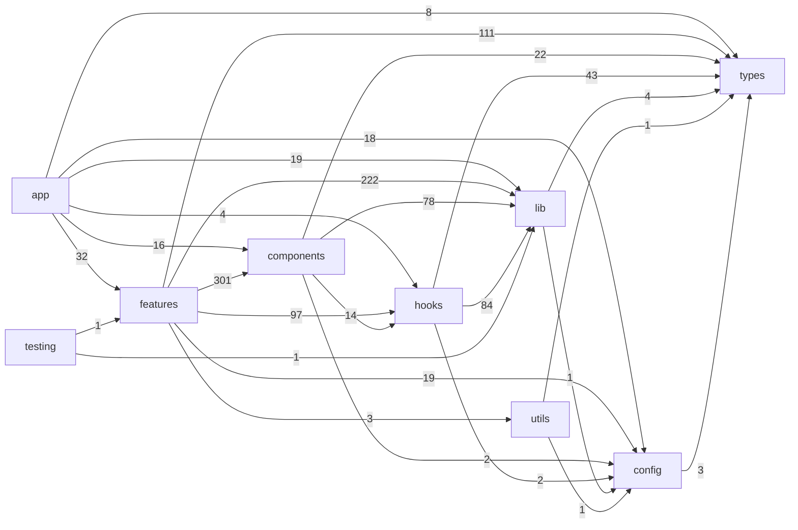

# Frontend Dependency Graph

> 自动生成文件。请勿手改；执行 `npm run docs:generate` 更新。

## 顶层层级依赖

| From | To | Imports |
|------|----|---------|
| `app` | `features` | 32 |
| `app` | `components` | 16 |
| `app` | `hooks` | 4 |
| `app` | `lib` | 19 |
| `app` | `config` | 18 |
| `app` | `types` | 8 |
| `features` | `components` | 301 |
| `features` | `hooks` | 97 |
| `features` | `lib` | 222 |
| `features` | `utils` | 3 |
| `features` | `config` | 19 |
| `features` | `types` | 111 |
| `components` | `hooks` | 14 |
| `components` | `lib` | 78 |
| `components` | `config` | 2 |
| `components` | `types` | 22 |
| `hooks` | `lib` | 84 |
| `hooks` | `config` | 2 |
| `hooks` | `types` | 43 |
| `lib` | `config` | 1 |
| `lib` | `types` | 4 |
| `utils` | `config` | 1 |
| `utils` | `types` | 1 |
| `config` | `types` | 3 |
| `testing` | `features` | 1 |
| `testing` | `lib` | 1 |

## Cross-feature 直接依赖

当前未发现 feature 对其他 feature 的直接源码依赖。

## 边界监控

- `feature -> app`：0
- `cross-feature`：0
- `shared -> feature`：0
- `shared -> app`：0
